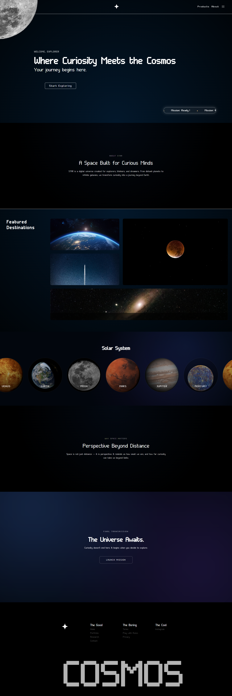

# 🌌 Cosmos Website

A modern and smooth **Galaxy themed based website** built using **HTML, CSS, and JavaScript**.  
This project focuses on clean UI, smooth scroll effects, and responsive layout.

---

## 🚀 Live Demo
🔗 https://cosmos-eight-pink.vercel.app/

---

## 📸 Preview


---

## 🛠️ Tech Stack
- **HTML5** – Structure  
- **CSS3** – Styling & parallax effects  
- **JavaScript (Vanilla)** – Scroll interactions  
- **Git & GitHub** – Version control  

---

## ✨ Features
- Smooth parallax scrolling effect  
- Clean and minimalist UI  
- Fully responsive design  
- Lightweight & fast loading  
- Easy to customize  

---

## 📂 Project Structure
```text
parallax-website/
├── index.html
├── style.css
├── script.js
├── imgs/
├── icons/
├── fonts/
└── assets/
